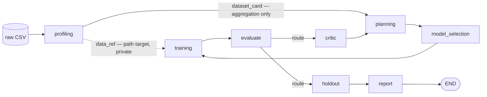

# 🤖 AutoML Agent

* 버전: `0.2.4`
* 복사해서 쓰는 명령 모음: [RUNBOOK.md](RUNBOOK.md)

<br>

## 프로젝트 소개

* **LLM에 raw data를 노출하지 않는** LangGraph 기반 AutoML agent입니다.
* CSV 파일과 target column을 지정하면 planning → model 탐색·선정 → training → validation·evaluation → critic → replanning loop를 자동으로 돌고, 목표 성능을 달성하거나 budget을 다 쓰면 최종 보고서를 만듭니다.
* LLM에는 **Dataset Card**(통계 요약)만 전달됩니다. Model 선정과 hyperparameter 제안은 LLM이 맡고, pipeline 검증과 loop 종료 판단은 코드가 통제합니다.
* 최종 평가는 loop에서 격리된 **holdout test set**으로 단 1회만 수행하여, 보고 점수가 model 선정 과정에 오염되지 않도록 합니다.
* Claude Code plugin을 지원하여 대화로 실행하고 결과를 조회할 수 있습니다.



<br>

## 1. 개발 환경

* 언어: Python 3.11+
* Workflow orchestration: LangGraph, `langgraph-checkpoint-sqlite`
* LLM: Anthropic API (직접 연동 및 AWS Bedrock 경유 지원), proposer node는 local Ollama 선택 가능
* Model 학습: scikit-learn, XGBoost (선택)
* 데이터 소스: CSV, SQLite, SQLAlchemy connection URL
* 코드 품질: ruff, mypy

<br>

## 2. 채택 기술 및 architecture 전략

### LangGraph 기반 state 관리

* Node 간 state를 독립된 channel로 나누기 위해 LangGraph를 도입했습니다. 원본 파일 경로(`data_ref`)와 집계 통계 요약(`dataset_card`)을 **서로 다른 channel**로 전달하여, LLM inference node가 원본 데이터 경로에 접근할 수 없도록 구조 수준에서 격리했습니다.
* 이전 시도 기록은 `operator.add` reducer로 state에 누적됩니다. 즉, 다음 시도가 이전 결과를 참고할 수 있는 것은 LLM의 기억이 아니라 공유 state 덕분입니다.
* SQLite checkpointer를 두어, 중단된 pipeline도 `resume` 명령으로 직전 시점부터 안전하게 이어갈 수 있습니다.

### Subprocess 기반 training 격리

* Model training은 항상 별도 subprocess에서 돌아갑니다. Training 중 OOM이나 CUDA error가 나도 main process는 죽지 않으며, subprocess가 끝나면 쓰던 메모리가 운영체제에 바로 반환됩니다.
* 원본 데이터에 직접 접근하는 스크립트는 다음 3개로 한정됩니다:
  [`profile.py`](automl_agent/scripts/profile.py) ·
  [`train.py`](automl_agent/scripts/train.py) ·
  [`predict.py`](automl_agent/scripts/predict.py)

<br>

## 3. 프로젝트 구조

```
├── automl_agent/
│   ├── main.py            CLI entry point (profile · run · resume · list · show · predict · graph)
│   ├── graph.py           LangGraph pipeline 구성 및 route() 종료 분기
│   ├── state.py           State channel 정의 (data_ref / dataset_card 분리)
│   ├── config.py          실행 설정 및 상수
│   ├── privacy.py         Prompt 누출 검사, 경로 masking, 민감 정보 제거
│   ├── capabilities.py    실행기가 지원하는 기능 목록 (whitelist)
│   ├── threads.py         BLAS / OpenMP thread 설정 기록 및 비교
│   ├── nodes/             Pipeline node (profiling · planning · model_selection · training · evaluate · critic · holdout · report)
│   ├── llm/               LLM client 및 prompt template (prompts/*.md)
│   ├── scoring/           Data split, 동적 target 산출, metric, bootstrap CI, calibration, model ranking
│   ├── dataset/           데이터 소스 loader, target·feature 규칙, sentinel 값 탐지, preprocessing
│   └── scripts/           Subprocess로 실행되는 스크립트 (profile.py · train.py · predict.py)
├── skills/                Claude Code plugin skill (automl-run, automl-results)
├── examples/              Dataset card 샘플 JSON
└── RUNBOOK.md             복사해서 쓰는 명령 모음
```

<br>

## 4. 핵심 설계 원칙

### Raw data 엄격 격리 (이중 방어선)

* **구조적 격리**: LLM inference node는 집계 요약인 `dataset_card`만 받습니다. Prompt를 만드는 코드는 pandas 자체를 import하지 않도록 분리되어 있습니다.
* **Fail-safe backstop**: API 요청 직전 [`privacy.assert_clean`](automl_agent/privacy.py)이 모든 prompt 본문을 검사합니다. 비공개로 등록된 데이터 경로가 발견되면 전송을 막고 `RawDataLeak` exception으로 pipeline을 멈춥니다. Fallback으로 넘길 문제가 아니라 코드 결함으로 보기 때문입니다.

### 제안은 LLM, 검증과 실행은 코드

* LLM이 제안한 model 이름은 task(classification/regression)별 registry로 적합성을 검증하고, 미리 정한 alias로 정규화합니다. 지원하지 않는 hyperparameter key는 warning을 남기고 걸러냅니다.
* LLM이 만든 코드를 직접 실행(eval)하는 경로는 없습니다. Preprocessing도 whitelist로 정의된 JSON spec만 해석합니다.

### 코드가 결정하는 loop 종료

* Loop 종료는 [`route()`](automl_agent/graph.py)가 deterministic하게 판단합니다: **목표 성능 달성 → 최대 iteration 초과 → 성능 정체(연속 2회 개선 실패) → time budget 초과** 순서로 분기합니다.
* 목표 달성을 제외한 나머지 3가지 조건은 사용자 옵션으로 끌 수 없으므로 무한 loop가 생기지 않습니다.

### 실패를 exception이 아닌 구조화된 진단으로 처리

* Critic node는 structured schema에 따라 실패 원인을 8가지(`underfitting`, `overfitting`, `data_issue`, `hyperparam`, `oom`, `too_slow`, `wrong_model_family`, `unknown`)로 분류합니다.
* LLM API가 일시적으로 실패해도 rule-based 진단으로 바로 fallback하여, 진행 중인 iteration의 맥락을 잃지 않고 pipeline을 이어갑니다.

### 신뢰할 수 있는 평가 체계

* Holdout test set은 첫 training 전에 따로 떼어 두고, 탐색 loop가 끝난 뒤 **단 1회만** 채점합니다. 이 점수는 탐색 중 model 선정에 쓰이지 않습니다. 쓰는 순간 test set으로 model을 고르는 셈이 되어 test set overfitting이 생기기 때문입니다.
* 목표 성능은 dataset별 baseline을 기준으로 상대적으로 정합니다. 고정 threshold(예: `f1 >= 0.85`)를 일괄 적용하면 쉬운 dataset에서는 너무 일찍 멈추고, 어려운 dataset에서는 달성이 불가능해지기 때문입니다.

  ```text
  maximize: target = baseline + (1 - baseline) * margin
  minimize: target = baseline * (1 - margin)
  ```

* 모든 점수에는 95% bootstrap CI를 함께 적고, model 간 우열은 paired bootstrap 차이($\Delta$)로 판단합니다.

<br>

## 5. CLI 명령어 가이드

```bash
python -m pip install -e ".[dev]"
python -m automl_agent.main <command> [옵션]
```

### `run` — AutoML 탐색 pipeline 실행

* `--dataset-card` 또는 `--data` 중 하나는 필수입니다.
* `--no-llm`: 실제 training은 그대로 하되, 4개 inference node(planning · model_selection · critic · report)를 rule-based fallback으로 실행합니다. API key 없이도 동작합니다.
* `--dry-run`: LLM 호출과 training을 모두 mocking하여 pipeline 분기 흐름만 빠르게 점검합니다. Scenario(`success` (기본값) · `fail` · `oom` · `stall` · `slow` · `crash`)를 지정할 수 있습니다.

```text
$ python -m automl_agent.main run --dataset-card examples/dataset_card.json --thread-id demo --dry-run

[iter 1] model=hist_gbdt f1=0.7600 (goal 0.85) → critic: hyperparam
          방향: 계열은 유지하고 learning_rate와 깊이 조합을 다르게 탐색한다.
[iter 2] model=hist_gbdt f1=0.8100 (goal 0.85) → critic: hyperparam
          방향: 계열은 유지하고 learning_rate와 깊이 조합을 다르게 탐색한다.
[iter 3] model=hist_gbdt f1=0.8600 (goal 0.85) [목표 달성]
======================================================================
종료 사유: 목표 지표 달성
최고 성능: f1=0.8600 (iteration 3, model=hist_gbdt)
총 반복: 3 / 5
```

| 주요 옵션 | 기본값 | 설명 |
| --- | --- | --- |
| `--metric` | `f1` | 최적화할 metric (classification: `f1`, `accuracy`, `balanced_accuracy`, `precision`, `recall`, `roc_auc`, `pr_auc` / regression: `r2`, `mae`, `rmse`) |
| `--threshold` | 없음 | 고정 목표 threshold (없으면 baseline 대비 자동 계산) |
| `--margin` | `0.25` | 자동 계산 시 baseline 위 남은 여지 중 목표로 삼을 비율 |
| `--max-iterations` | `5` | 최대 iteration 횟수 |
| `--time-budget-sec` | `3600` | 전체 제한 시간(초). 10%는 최종 holdout 평가용으로 남겨 둠 |
| `--search-past-goal` | 꺼짐 | 목표를 일찍 달성해도 최대 iteration까지 계속 탐색 |
| `--group-column` | 없음 | train/val/test 간 leakage를 막는 group column (예: 환자 ID) |
| `--caveat` | 없음 | 모든 prompt에 넣을 dataset 주의사항 |
| `--keep-models` | `best` | 실행 후 남길 `model.joblib` (`best` 또는 `all`) |

LLM backend 설정:

| Backend | 필요한 환경 변수·옵션 | 추가 패키지 |
| --- | --- | --- |
| Anthropic API 직접 연동 | `ANTHROPIC_API_KEY` | 없음 |
| AWS Bedrock 경유 | `AUTOML_USE_BEDROCK=1`, `AWS_REGION` | `.[bedrock]` |
| Proposer node만 local Ollama | `--proposer-model ollama:<모델명>` 및 `ANTHROPIC_API_KEY` | 없음 |

### `profile` — Dataset Card 생성

* 원본 데이터를 분석해 통계 요약 JSON과 logistic regression(`logreg`) baseline 점수를 만듭니다. 전체 pipeline을 돌리기 전에 card를 검토하거나 고칠 때 씁니다.
* `--data`는 CSV, SQLite 파일, SQLAlchemy URL을 받으며, database는 `--table` 또는 `--query`로 읽을 행을 정합니다.

```bash
python -m automl_agent.main profile --data local/demo.csv --target died \
    --out local/demo_card.json --caveat "died는 퇴원 후 30일 기준"
```

### `resume` · `list` · `show` — 실행 session 및 기록 관리

* `resume`: 중단된 session을 `--thread-id`로 이어서 실행합니다. 실행 인자와 state는 `run_config.json`에서 자동으로 불러옵니다.
* `list`: 기록된 실행 목록과 요약을 출력합니다.

```text
thread_id                방식     지표    최고(val)      test     반복 종료
---------------------------------------------------------------------------
readme-demo              dry-run  f1         0.8600         —      3/5 목표 지표 달성
```

* `show --report`: 특정 session의 state와 국문 최종 보고서 전문을 출력합니다.

### `predict` — 최종 model로 batch inference

* 탐색에서 뽑힌 model을 새 CSV에 적용합니다. `--label-column`을 주면 그 데이터에 대한 채점도 함께 합니다.
* Model은 항상 training 때 확정된 preprocessing schema(`feature_schema.json`)와 함께 쓰여 feature가 어긋나지 않습니다.

```bash
python -m automl_agent.main predict --thread-id demo --data local/new.csv \
    --id-column patient_id --label-column died
```

### `graph` — Pipeline 구조 시각화

* 현재 LangGraph pipeline 구조를 `.png` 이미지 또는 `.mmd`(Mermaid) 파일로 내보냅니다.

### Claude Code plugin

* [`skills/automl-run`](skills/automl-run): Claude Code와 대화하며 AutoML pipeline을 실행합니다.
* [`skills/automl-results`](skills/automl-results): 실행 목록 조회, 시도 기록 탐색, 최종 보고서와 주요 통계 확인을 지원합니다.

<br>

## 코드 검사

```bash
python -m ruff check .
python -m mypy
```

## 라이선스

[MIT](LICENSE) 라이선스로 배포됩니다. `local/`에 두는 원본 데이터는 git이 무시하므로 저장소에 올라가지 않습니다.
